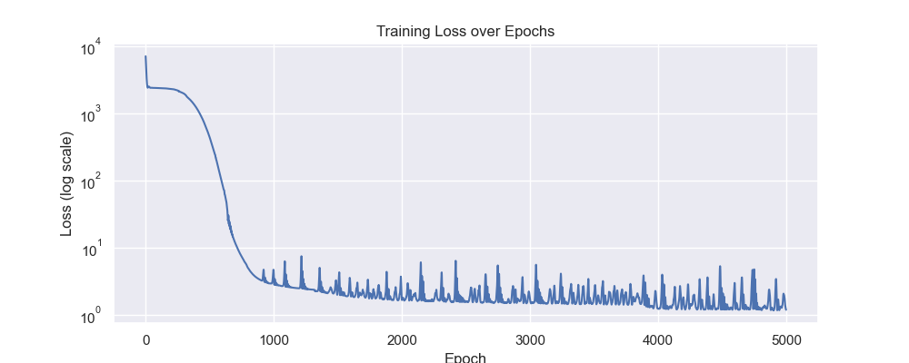
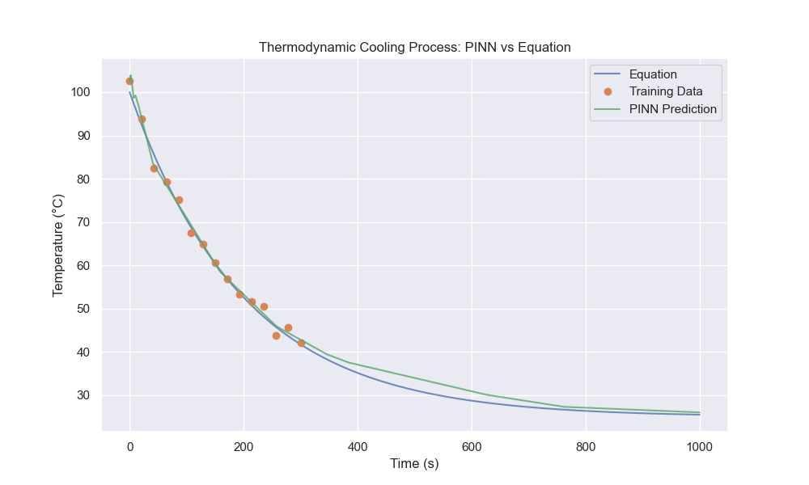
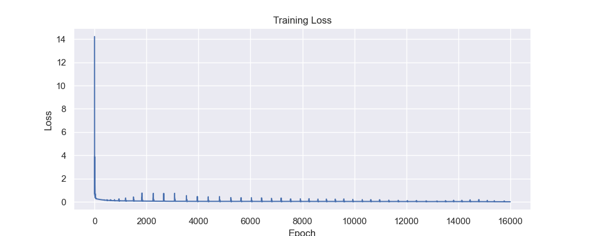
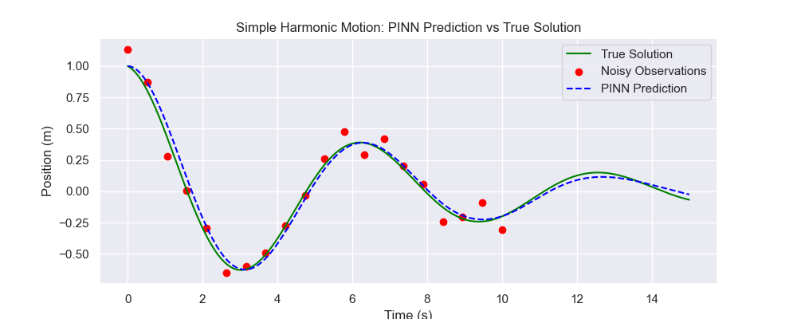

# PINNs

Physics-Informed Neural Networks (PINNs) implementation for modeling thermodynamic cooling processes using PyTorch.

## Description

This project demonstrates the use of Physics-Informed Neural Networks (PINNs) to solve differential equations governing thermodynamic cooling. The example models Newton's Law of Cooling using a neural network trained on sparse data while enforcing physical constraints.

## Installation

1. Ensure Python 3.12+ and Poetry are installed.
2. Clone or download the repository.
3. (Optional) Create a virtual environment: `python -m venv venv` and activate it (`venv\Scripts\activate` on Windows).
4. Install dependencies: `poetry install` (from the project root).

## Usage

### Thermodynamic cooling experiment

Run the thermodynamic cooling example:

```bash
cd cooling
python main_thermo.py
```

This will train a PINN model and display plots of training loss and temperature predictions.





### Harmonic oscillator experiment

Run the damped harmonic oscillator example:

```bash
cd harmonic_motion
python main_HM.py
```

This will train a PINN model and display plots of training loss and position predictions.





## Project Structure

- `cooling/`: Cooling experiment
  - `main_thermo.py`: Example script for cooling process modeling
  - `networks.py`: PINN neural network implementation
  - `equations.py`: Physical equations and utilities
- `harmonic_motion/`: damped harmonic oscillator experiment
  - `main_HM.py`: Example script for harmonic motion modeling
  - `networks.py`: PINN neural network implementation
  - `equations.py`: Physical equations and utilities
- `imgs/`: images for plots
- `pyproject.toml`: Project configuration and dependencies
- `README.md`: This file

## Dependencies

- torch (>=2.9.1,<3.0.0)
- matplotlib (>=3.10.8,<4.0.0)
- numpy (>=2.4.1,<3.0.0)
- seaborn (>=0.13.2,<0.14.0)


